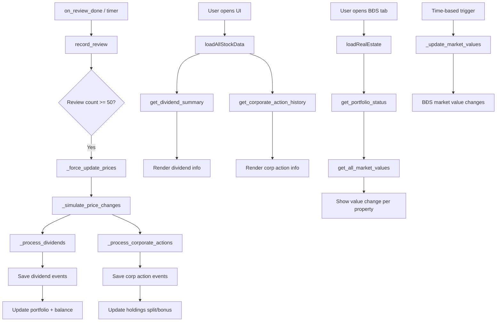

# Kế hoạch mở rộng: BĐS Investment & Stock Dividends + Corporate Actions

## Tổng quan

Hai feature expansion song song, tận dụng cơ chế hiện có (config persistence, seeded PRNG, bridge pattern).

---

## I. BĐS Investment Expansion (`real_estate.py`)

### 1.1 Market Value Fluctuation

**Cơ chế**: Giá trị thị trường của BĐS biến động theo thời gian, giống thị trường nhà đất thực tế nhưng đơn giản hơn.

- **Key**: `anki_tycoon_re_market` — dict `{item_id: {"market_value": int, "last_updated": float, "trend": float}}`
- **Seed**: Dùng seed dựa trên timestamp (làm tròn 6h) + item_id → deterministic
- **Công thức**:
  ```
  market_value = round(price * (1.0 + sin(seed_component) * 0.15 + trend * days_elapsed))
  ```
  - Biên độ dao động: ±15% giá mua
  - Trend: drift ngẫu nhiên ±0.5%/ngày (seeded)
- **Khi bán**: `remove_property()` trả về `sell_price = current_market_value` thay vì 50% cố định
- **Rủi ro**: Có thể bán lỗ nếu thị trường đang xuống

**Hàm mới**:
```python
def _update_market_values() -> dict:
    """Cập nhật giá trị thị trường cho tất cả BĐS. Trả về dict {item_id: market_value}."""
    
def get_market_value(item_id: str, price: int) -> int:
    """Lấy giá trị thị trường hiện tại của 1 BĐS."""
    
def get_all_market_values() -> dict:
    """Trả về {item_id: market_value} cho UI hiển thị chênh lệch."""
```

### 1.2 Renovation / Upgrade

**Cơ chế**: Đầu tư nâng cấp BĐS → tăng fair_rent + market_value.

- **Key**: `anki_tycoon_re_upgrades` — dict `{slot_id: {"level": int, "upgraded_at": float, "total_spent": int}}`
- **Mỗi cấp**:
  - Chi phí: `price * 0.08 * level` (cấp 1 = 8% giá mua, cấp 2 = 16%, etc.)
  - Tác dụng: +10% fair_rent, +8% market_value per level
  - Max level: 5
- **Gọi từ bridge**: `upgradeProperty(slot_id)` → trả tiền → tăng level

**Hàm mới**:
```python
def upgrade_property(slot_id: str) -> dict:
    """Nâng cấp BĐS. Trả về {ok, error, new_level, cost, new_fair_rent}."""

def get_upgrade_info(slot_id: str) -> dict:
    """Trả về {level, max_level, next_cost, fair_rent_bonus, value_bonus}."""
```

### 1.3 Enhanced Portfolio Info

Bổ sung field vào `get_portfolio_status()`:
```python
# Mỗi property thêm:
"market_value": int,          # Giá trị thị trường hiện tại
"value_change": int,          # Chênh lệch so với giá mua (+/-)
"value_change_pct": float,    # % chênh lệch
"upgrade_level": int,         # Cấp nâng cấp (0 = chưa upgrade)
"upgrade_count": int,         # Tổng số lần upgrade
"roi_pct": float,             # Tổng (đã thu + chênh lệch giá) / giá mua
```

### 1.4 Summary Functions

```python
def get_re_summary() -> dict:
    """Tổng quan: tổng giá mua, tổng giá trị thị trường, tổng equity, unrealized PnL."""
```

---

## II. Stock Dividends & Corporate Actions (`stock_market.py`)

### 2.1 Dividend System

**Cơ chế**: Cổ tức tiền mặt trả định kỳ khi giá cập nhật.

- **Tần suất**: Mỗi stock có 1/4 chance mỗi lần `_simulate_price_changes()` (khoảng ~25%/lần cập nhật)
- **Tỷ lệ cổ tức**: `base_price * random(0.3%, 1.5%)` — seeded theo symbol + cycle
- **Điều kiện**: Chỉ trả nếu stock đang "hoạt động tốt" (giá > 90% base_price)
- **Người nhận**: Tất cả holder trong portfolio nhận cổ tức theo số lượng shares
- **Key mới**: `anki_tycoon_stocks_dividends` — dict `{symbol: {"last_div": timestamp, "total_paid": int}}`
- **Ghi nhận**: Ghi vào `add_transaction("dividend", ...)` + lịch sử stock txns

**Hàm mới**:
```python
def _process_dividends(market: dict) -> list:
    """
    Xử lý cổ tức cho tất cả stock.
    Trả về list các dividend payment đã ghi nhận.
    """
    
def get_dividend_history(symbol: str = None, limit: int = 20) -> list:
    """Lịch sử cổ tức đã nhận."""
    
def get_dividend_summary() -> dict:
    """Tổng cổ tức đã nhận, dividend yield trung bình."""
```

### 2.2 Corporate Actions

**Cơ chế**: Sự kiện hiếm (2-5% mỗi lần cập nhật giá).

#### a) Stock Split
- **Kích hoạt**: Giá > 200% base_price và random(0.02) < 0.02
- **Hành động**: 
  - Tỷ lệ split từ {2:1, 3:1, 5:1} (random)
  - Số lượng shares × ratio
  - Giá ÷ ratio
  - avg_cost ÷ ratio
  - total_invested không đổi
- **Ghi nhận**: `add_transaction("stock_split", ...)`

#### b) Bonus Shares (cổ phiếu thưởng)
- **Kích hoạt**: stock có change_pct > 5% trong phiên và random(0.03) < 0.03
- **Hành động**:
  - Tặng thêm 5-10% số lượng shares đang nắm giữ
  - avg_cost giảm tương ứng
  - total_invested không đổi
- **Ghi nhận**: `add_transaction("bonus_share", ...)`

#### c) Rights Issue (phát hành thêm quyền mua)
- **Kích hoạt**: Giá < 70% base_price (công ty cần vốn)
- **Hành động**: Holder được quyền mua thêm với giá ưu đãi (80% thị trường)
- **UI**: Hiện thông báo + nút "Thực hiện quyền"

**Hàm mới**:
```python
def _process_corporate_actions(market: dict) -> list:
    """Xử lý corporate actions. Trả về list các sự kiện."""
    
def get_corporate_action_history(limit: int = 20) -> list:
    """Lịch sử corporate actions."""
```

### 2.3 Enhanced Stock Data

Bổ sung field vào stock data:
```python
# Mỗi stock trong market có thêm:
"dividend_yield": float,      # % cổ tức / năm (mô phỏng)
"last_dividend": float,       # timestamp trả cổ tức gần nhất
"ex_dividend_date": float,    # timestamp ngày không hưởng quyền
```

Bổ sung vào portfolio:
```python
# Mỗi holding thêm:
"total_dividends": int,       # Tổng cổ tức đã nhận
"bonus_shares": int,          # Tổng cổ phiếu thưởng đã nhận
```

---

## III. Web Bridge Updates (`gui/web_bridge.py`)

### 3.1 New BĐS Bridge Slots

```python
@pyqtSlot(result=str)
def getREMarketValues(self):       # Trả về {item_id: market_value}

@pyqtSlot(str, result=str)
def getPropertyUpgradeInfo(self, slot_id):  # Trả về upgrade info

@pyqtSlot(str, result=str)
def upgradeProperty(self, slot_id):         # Thực hiện upgrade

@pyqtSlot(result=str)
def getRESummary(self):                    # Trả về tổng quan BĐS
```

### 3.2 New Stock Bridge Slots

```python
@pyqtSlot(result=str)
def getDividendHistory(self):      # Lịch sử cổ tức

@pyqtSlot(result=str)
def getDividendSummary(self):      # Tổng quan cổ tức

@pyqtSlot(result=str)
def getCorporateActionHistory(self):  # Lịch sử corporate actions
```

### 3.3 Dashboard Data Update

Thêm vào `getDashboardData()`:
```python
"re_summary": {total_market_value, total_invested, unrealized_pnl, total_pending_rent}
"stock_dividends": {total_received, recent_dividend}
```

---

## IV. UI Updates (`tycoon_ui.html`)

### 4.1 BĐS Page (`#page-realestate`)

- **Overview grid**: Thêm "Tổng giá trị thị trường", "Lời/lỗ chưa thực hiện", "Tổng equity"
- **Mỗi thẻ BĐS**: Thêm badge chênh lệch giá trị thị trường (📈 +x% / 📉 -x%)
- **Nút "Nâng cấp"**: Mở modal upgrade (hiện chi phí, lợi ích, xác nhận)
- **Modal upgrade**: Hiện cấp hiện tại, chi phí nâng cấp, fair_rent mới, market_value mới

### 4.2 Stock Page (`#page-stocks`)

- **Danh sách cổ phiếu**: Thêm badge dividend yield
- **Portfolio**: Thêm cột "Cổ tức nhận được", "Cổ phiếu thưởng"
- **Tab mới**: "📊 Cổ tức & Sự kiện" — hiện lịch sử dividend + corporate actions
- **Modal stock detail**: Thêm thông tin dividend yield, lịch sử cổ tức
- **Toast notification**: Khi nhận cổ tức hoặc có corporate action

### 4.3 Notification Strip

Thêm badge/chữ chạy ở trên cùng khi có sự kiện quan trọng:
- "📊 VCB vừa trả cổ tức 850đ/cp!"
- "🏠 Giá trị căn hộ chung cư tăng 5.2%!"
- "🔀 HPG đã tách cổ phiếu tỷ lệ 2:1"

---

## V. Trigger Points

### 5.1 Tích hợp vào `__init__.py`

- **`_on_profile_loaded()`**: Gọi `_update_market_values()` + `_auto_collect_rent()` đã có
- **`on_review_done()`**: Đã trigger `record_review()` → stock price update → gián tiếp trigger dividends + corp actions

### 5.2 Tích hợp vào `_force_update_prices()`

Sau khi `_simulate_price_changes()`, thêm:
```python
# Process dividends
div_events = _process_dividends(market)
if div_events:
    # Lưu vào config để UI/show toast
    _save_dividend_events(div_events)

# Process corporate actions
ca_events = _process_corporate_actions(market)
if ca_events:
    _save_corp_action_events(ca_events)
```

---

## VI. File Changes Summary

| File | Changes |
|------|---------|
| `real_estate.py` | + market value fluctuation, + renovation/upgrade, + enhanced portfolio info |
| `stock_market.py` | + dividend system, + corporate actions (split, bonus, rights), + enhanced stock/portfolio data |
| `gui/web_bridge.py` | + 7 bridge slots, update dashboard data |
| `gui/tycoon_ui.html` | BĐS: value change display, upgrade UI. Stock: dividend tab, corp action history, notifications |
| `__init__.py` | Trigger dividend/corp action processing |

---

## VII. Data Flow Diagram



---

## VIII. Implementation Order

1. **`real_estate.py`** — Market value fluctuation + renovation + enhanced portfolio
2. **`stock_market.py`** — Dividends + corporate actions + enhanced data
3. **`gui/web_bridge.py`** — New bridge slots
4. **`gui/tycoon_ui.html`** — UI changes for both features
5. **Biên dịch & kiểm thử**
