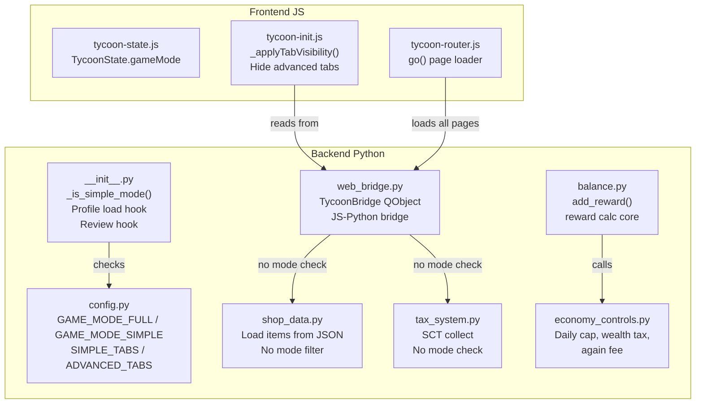

# Đánh giá thiết kế 2 Game Mode — Anki Finance

> **Người đánh giá:** Architect Mode
> **Mục tiêu:** Đánh giá tính hợp lý, mức độ "đủ đô", realistic, và phát hiện các lỗ hổng implementation giữa Simple Mode và Full Mode.

---

## 1. Tổng quan kiến trúc hiện tại



## 2. Đánh giá Simple Mode

### 2.1. Features hiện tại (15+ features)

| # | Feature | Đánh giá | Lý do |
|---|---------|----------|-------|
| 1 | Reward/Penalty core | ✅ **Giữ lại** | Cốt lõi của game |
| 2 | Streak System | ✅ **Giữ lại** | Động lực học hàng ngày |
| 3 | XP / Rank | ✅ **Giữ lại** | Cảm giác tiến bộ |
| 4 | Daily Quest | ✅ **Giữ lại** | Nhiệm vụ hàng ngày đơn giản |
| 5 | Energy System | ⚠️ **Có thể bỏ** | Giới hạn số thẻ học, gây khó chịu cho người mới |
| 6 | Shop + Inventory | ✅ **Giữ lại** | Cần cho core loop |
| 7 | Bank | ✅ **Giữ lại** | Dạy tiết kiệm cơ bản |
| 8 | Knowledge Base | ✅ **Giữ lại** | Giáo dục tài chính |
| 9 | Goals | ✅ **Giữ lại** | Mục tiêu đơn giản |
| 10 | Food / Boost | ✅ **Giữ lại** | Tương tác thú vị |
| 11 | Living Costs | ❌ **Nên cân nhắc bỏ** | Trừ tiền hàng ngày — punishing cho newbie |
| 12 | Tax (basic) | ⚠️ **Có thể bỏ** | Thêm độ phức tạp không cần thiết |
| 13 | Achievements | ✅ **Giữ lại** | Động lực dài hạn |
| 14 | Again Tracker | ✅ **Giữ lại** | Cần cho penalty |
| 15 | Inactivity Penalty | ❌ **Nên cân nhắc bỏ** | Phạt vì không học = phản cảm với người mới |

### 2.2. Vấn đề: Simple Mode vẫn còn nhiều thứ

**Simple Mode có tới 15+ features** — con số này không hề "simple". Một người mới bắt đầu sẽ bị choáng ngợp bởi:
- Năng lượng (Energy System) — giới hạn số thẻ được học
- Thuế (Tax) — khái niệm tài chính phức tạp
- Chi phí sinh hoạt (Living Costs) — tự động trừ tiền mỗi ngày
- Phí vắng mặt (Inactivity Penalty) — bị phạt khi không học

**Đề xuất:** Simple Mode nên tập trng vào 8-10 features core nhất:
`Reward > Streak > XP/Rank > Daily Quest > Shop > Inventory > Bank > Goals > Achievements`

Bỏ hoặc đơn giản hoá: Energy System, Tax, Living Costs, Inactivity Penalty.

## 3. Đánh giá Full Mode

### 3.1. Features hiện tại (25+ features)

Bao gồm tất cả Simple + 12 hệ thống nâng cao:

| # | Feature | Đánh giá | Lý do |
|---|---------|----------|-------|
| 1 | Stock Market | ✅ **Đủ đô** | Limit order, stop-loss, dividend, trading session |
| 2 | Digital Assets / Crypto | ✅ **Đủ đô** | Staking, market cycle, meme coin |
| 3 | Vehicle System | ✅ **Đủ đô** | Durability, fuel, maintenance, breakdown |
| 4 | Real Estate | ✅ **Đủ đô** | Rent, upgrade, market value |
| 5 | Credit Banking | ✅ **Đủ đô** | Credit score, credit card, loan, installment |
| 6 | Bond System | ✅ **Đủ đô** | Coupon, maturity |
| 7 | Tech Lab | ✅ **Đủ đô** | Durability, active/passive effects |
| 8 | Economy Controls | ✅ **Đủ đô** | Daily cap, CPI, wealth tax, garage fees |
| 9 | Emergency Events | ✅ **Đủ đô** | Random financial events |
| 10 | Advanced Tax (SCT) | ✅ **Đủ đô** | Special consumption tax |
| 11 | Study Items (weekly limit) | ✅ **Đủ đô** | Giới hạn học tập |
| 12 | KN Perks | ✅ **Đủ đô** | Unlock perks bằng Knowledge |

### 3.2. Full Mode có "đủ đô" không?

**CÓ**, Full Mode rất "đủ đô" cho một Anki addon. Hệ thống bao phủ đầy đủ các mặt:
- **Đầu tư:** Stocks, Crypto, Real Estate, Bonds
- **Tiêu dùng:** Vehicles, Tech, Luxury, Insurance
- **Tài chính:** Credit cards, Loans, Savings, Budget
- **Rủi ro:** Emergency events, Breakdowns, Market crashes
- **Kiểm soát:** Daily cap, Wealth tax, CPI, SCT

**Có thể thêm trong tương lai (nice-to-have, không critical):**
- Hệ thống doanh nghiệp/startup (business management)
- Hệ thống chứng khoán phái sinh nâng cao (options, futures)
- PvP leaderboard / so tài giữa người dùng

### 3.3. Full Mode có "realistic" không?

**Khá realistic** so với mô phỏng tài chính trong phạm vi Anki addon:
- Interest rate, dividend, inflation (CPI), tax là các khái niệm thực tế
- Cơ chế cung-cầu và diminishing returns phản ánh kinh tế thật
- Emergency events mô phỏng rủi ro tài chính đời thực

Tuy nhiên, có một số điểm chưa realistic:
- **Giá xe/crypto có phần ảo** — xe 40 tỷ trong game mua bằng tiền từ học thẻ
- **Thiếu chu kỳ kinh tế dài hạn** — Không có recession/boom cycle rõ rệt
- **Tác động của hành vi người chơi đến thị trường còn hạn chế** — Giá cả do thuật toán, không phải cung-cầu thực

## 4. Phát hiện lỗ hổng Implementation

### 🔴 Critical: Shop không filter item theo mode

**File:** [`gui/web_bridge.py:214-216`](gui/web_bridge.py:214)
**File:** [`shop_data.py:17-57`](shop_data.py:17)

```python
@pyqtSlot(result=str)
def getShopItems(self):
    items = _enrich_items(load_shop_items())  # ← Không có mode filter!
    return json.dumps(items, ensure_ascii=False)
```

**Vấn đề:** Simple Mode player có thể mua:
- 🚗 Xe hơi, xe máy, xe đạp (category: "🚗 Showroom xe")
- 💻 Công nghệ (category: "💻 Cửa hàng đồ công nghệ")  
- 🏠 Bất động sản (category: "🏠 Thị trường bất động sản")
- 🪙 Crypto (category: "🪙 Sản Crypto")
- 🏦 Vật phẩm tài chính (category: "🏦 Vật phẩm tài chính")
- 💎 Hàng hiệu (category: "💎 Cửa hàng hàng hiệu")
- 🛡️ Bảo hiểm (category: "🛡️ Bảo hiểm")

Mặc dù UI tabs bị ẩn, nhưng item vẫn hiện trong shop và có thể mua được.

### 🔴 Critical: SCT (Special Consumption Tax) không check mode

**File:** [`gui/web_bridge.py:369-377`](gui/web_bridge.py:369)
**File:** [`gui/web_bridge.py:617-625`](gui/web_bridge.py:617)

```python
# Trong buyItem() và processShopPayment()
try:
    from ..tax_system import collect_sct, get_sct_for_item
    sct_info = get_sct_for_item(item)
    if sct_info["has_sct"]:
        sct_amount = collect_sct(item)  # ← Chạy trong cả 2 mode!
```

**Vấn đề:** Thuế tiêu thụ đặc biệt (SCT) — vốn là Full Mode feature — vẫn được collect trong Simple Mode.

### 🟡 Medium: Economy Controls rò rỉ sang Simple Mode

**File:** [`balance.py:170-181,207-211,236-240,288-297`](balance.py:170)

```python
# add_reward() import economy_controls trong cả 2 mode
try:
    from .economy_controls import (
        get_daily_cap_multiplier,     # ← Chạy trong Simple Mode
        apply_wealth_tax_on_reward,   # ← Chạy trong Simple Mode
        get_again_recovery_fee,       # ← Chạy trong Simple Mode
    )
    econ_available = True
```

**Phân tích:**
- `get_daily_cap_multiplier()` — **An toàn** vì `increment_daily_cards_count()` chỉ chạy ở Full Mode, nên daily count luôn = 0 → multiplier luôn = 1.0
- `apply_wealth_tax_on_reward()` — **Rò rỉ!** Wealth tax áp dụng lên reward trong Simple Mode
- `get_again_recovery_fee()` — **Rò rỉ!** Phí phục hồi Again (dựa trên % balance) áp dụng trong Simple Mode

### 🟡 Medium: Passive effects từ advanced items vẫn active nếu Simple player mua được

Nếu Simple player mua được xe/crypto/tech/BĐS qua shop (lỗ hổng #1), các passive effects (xp_multiplier, interest_bonus, etc.) vẫn được đăng ký và active nhờ code ở [`gui/web_bridge.py:313-314,352-367`](gui/web_bridge.py:313).

### 🟢 Low: Dashboard vẫn load data advanced

**File:** [`gui/web_bridge.py:169-208`](gui/web_bridge.py:169)

```python
# getDashboardData() luôn load BĐS + Stock dividend
re_summary = get_re_summary()        # ← Chạy trong cả 2 mode
stock_dividends = get_dividend_summary()  # ← Chạy trong cả 2 mode
```

Không gây lỗi nhưng gây waste CPU và network.

## 5. Kết luận & Khuyến nghị

### Tổng quan đánh giá

| Tiêu chí | Điểm | Nhận xét |
|----------|------|----------|
| **Hợp lý (Reasonable)** | ⭐⭐⭐⭐☆ | Phân chia core vs advanced hợp lý về mặt concept |
| **Đủ đô (Comprehensive)** | ⭐⭐⭐⭐⭐ | Full Mode rất đầy đủ cho Anki addon |
| **Realistic** | ⭐⭐⭐⭐☆ | Mô phỏng tài chính khá tốt, một số điểm chưa thực tế |
| **Implementation** | ⭐⭐⭐☆☆ | Có 2 lỗ hổng critical + 2 medium cần fix |

### Khuyến nghị hành động

#### ✅ Đã fix trong v1.2.0b:
1. **Filter shop items theo mode** — `getShopItems()` và `buyItem()` trong [`gui/web_bridge.py`](gui/web_bridge.py:217) đã filter theo `ADVANCED_CATEGORIES` khi `_is_simple_mode()`.
2. **Gate wealth tax + again recovery fee** — [`balance.py:add_reward()`](balance.py:139) dùng `_simple` flag, chỉ apply economy controls trong Full Mode.

#### Còn lại:
3. **Gate SCT theo mode** — Chỉ collect SCT khi `not _is_simple_mode()` (hiện tại SCT chỉ áp dụng cho advanced categories đã bị block, nên impact thấp)
4. **Đơn giản hoá Simple Mode** — Cân nhắc bỏ Energy System, Living Costs, Inactivity Penalty, Tax (basic) khỏi Simple Mode để đúng tinh thần "simple"
5. **Review lại shop item ownership** — Nếu Simple player có advanced items từ trước khi chuyển mode, cần xử lý migration
