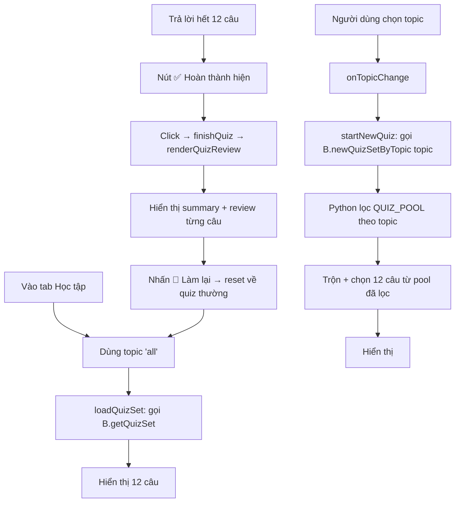

# Kế hoạch v1.0.5: Quiz Filter theo Chủ đề + Review Mode

## Tổng quan

Hai tính năng mới cho Finance Quiz:
1. **Quiz Filter theo Chủ đề** — Cho phép lọc câu hỏi theo 10 chủ đề tài chính
2. **Quiz Review Mode** — Sau khi hoàn thành 12 câu, xem lại tất cả câu hỏi + đáp án

**Nguyên tắc**: KHÔNG phá vỡ code hiện có. Các phương thức bridge cũ vẫn hoạt động.

---

## 1️⃣ Quiz Filter theo Chủ đề

### 1.1 Thêm trường `topic` vào QUIZ_POOL
**File**: [`finance_quiz.py`](finance_quiz.py:25)

Mỗi câu hỏi trong `QUIZ_POOL` cần thêm key `"topic"` với giá trị slug (không dấu, không khoảng trắng).

**10 chủ đề + slug**:
| Slug | Hiển thị | Số câu |
|------|----------|--------|
| `lai_kep` | ⏳ Lãi kép & Thời gian | ~6 |
| `chung_khoan` | 📈 Chứng khoán | ~8 |
| `crypto` | ₿ Crypto | ~5 |
| `bat_dong_san` | 🏠 Bất động sản | ~4 |
| `ngan_hang` | 🏦 Ngân hàng & Tiết kiệm | ~4 |
| `quan_ly_no` | 📉 Quản lý nợ | ~4 |
| `fire` | 🔥 Ngân sách & FIRE | ~4 |
| `bao_hiem` | 🛡️ Bảo hiểm | ~2 |
| `tong_hop` | 🧠 Tổng hợp & Tư duy | ~7 |
| `nang_cao` | 🚀 Nâng cao | ~11 |

**Thêm**: `QUIZ_TOPICS` dict mapping slug → display name + emoji.

### 1.2 Sửa `get_quiz_set()` nhận tham số topic
**File**: [`finance_quiz.py`](finance_quiz.py:548) → sửa hàm `get_quiz_set(topic=None)`

```python
def get_quiz_set(topic: str | None = None) -> list:
    pool = list(QUIZ_POOL)
    if topic and topic != "all":
        pool = [q for q in pool if q.get("topic") == topic]
    random.shuffle(pool)
    selected = pool[:QUIZ_SET_SIZE]
    ...
    # Lưu topic vào config để UI biết
    cfg_set("anki_tycoon_quiz_topic", topic or "all")
```

Nếu pool đã lọc có ít hơn `QUIZ_SET_SIZE` câu → return tất cả.

### 1.3 Thêm `get_quiz_set_by_topic()` ở bridge
**File**: [`gui/web_bridge.py`](gui/web_bridge.py:1432)

Thêm slot mới — KHÔNG sửa slot cũ:
```python
@pyqtSlot(str, result=str)
def newQuizSetByTopic(self, topic: str):
    """Tạo bộ câu hỏi mới theo chủ đề."""
    try:
        from ..finance_quiz import get_quiz_set, QUIZ_SET_SIZE, QUIZ_TOPICS
        data = get_quiz_set(topic)
        return json.dumps({
            "quiz_set": data,
            "set_size": QUIZ_SET_SIZE,
            "topic": topic,
            "topic_name": QUIZ_TOPICS.get(topic, topic),
        }, ensure_ascii=False)
    except Exception:
        return json.dumps({"quiz_set": [], "set_size": 12}, ensure_ascii=False)
```

### 1.4 Thêm dropdown chủ đề ở Learning page
**File**: [`gui/tycoon_ui.html`](gui/tycoon_ui.html:2622)

**HTML** — Thêm `<select>` trong quiz header, gần nút "Bộ câu mới":
```html
<select id="quiz-topic-filter" class="inp" style="font-size:12px;padding:4px 8px;max-width:180px" onchange="onTopicChange()">
  <option value="all">📚 Tất cả chủ đề</option>
  <option value="lai_kep">⏳ Lãi kép & Thời gian</option>
  <option value="chung_khoan">📈 Chứng khoán</option>
  ...
</select>
```

**JS** — Thêm biến + xử lý:
```javascript
let quizTopic = 'all'; // topic filter hiện tại

async function onTopicChange() {
  const sel = document.getElementById('quiz-topic-filter');
  quizTopic = sel.value;
  await startNewQuiz(); // Tạo bộ câu mới với topic đã chọn
}
```

**JS** — Sửa `startNewQuiz()`:
```javascript
async function startNewQuiz() {
  if (quizLoading) return;
  quizLoading = true;
  const dom = _getQuizDom();
  dom.newBtn.textContent = '⏳ Đang tạo...';
  try {
    const raw = (quizTopic && quizTopic !== 'all')
      ? await B.newQuizSetByTopic(quizTopic)
      : await B.newQuizSet();
    const data = JSON.parse(raw);
    // ... phần còn lại giữ nguyên
```

---

## 2️⃣ Quiz Review Mode

### 2.1 Hiện trạng
- Sau khi trả lời hết 12 câu, nút "✅ Hoàn thành (X/Y đúng)" hiện
- `finishQuiz()` hiện tại chỉ reset về câu 0

### 2.2 Sửa `finishQuiz()` thành Review Mode
**File**: [`gui/tycoon_ui.html`](gui/tycoon_ui.html:5708)

```javascript
function finishQuiz() {
  // Chuyển sang review mode
  renderQuizReview();
}

function renderQuizReview() {
  const dom = _getQuizDom();
  const set = quizData.quiz_set;
  const total = set.length;
  const correctCount = set.filter((_, i) => quizResults[i] && quizResults[i].correct).length;
  
  // Tắt progress dots, thay bằng summary
  dom.progress.style.display = 'none';
  dom.qCounter.textContent = '';
  
  // Summary header
  const accuracy = total > 0 ? Math.round(correctCount / total * 100) : 0;
  dom.qText.innerHTML = `
    <div style="text-align:center;padding:16px 0">
      <div style="font-size:36px;margin-bottom:8px">${accuracy >= 80 ? '🏆' : accuracy >= 50 ? '👍' : '💪'}</div>
      <div style="font-size:18px;font-weight:800">Kết quả: ${correctCount}/${total} đúng</div>
      <div style="font-size:13px;color:var(--muted2);margin-top:4px">Độ chính xác: ${accuracy}%</div>
    </div>
  `;
  
  // Render từng câu hỏi + đáp án
  dom.options.innerHTML = set.map((q, i) => {
    const res = quizResults[i];
    const answered = quizAnswered[i];
    const isCorrect = res ? res.correct : false;
    const borderColor = isCorrect ? 'rgba(16,185,129,.3)' : 'rgba(239,68,68,.3)';
    return `
      <div style="border:1px solid ${borderColor};border-radius:10px;padding:12px;margin-bottom:10px;background:var(--surface2)">
        <div style="font-size:12px;color:var(--muted2);margin-bottom:6px">Câu ${i+1}/${total} ${isCorrect ? '✅' : '❌'}</div>
        <div style="font-size:14px;font-weight:600;margin-bottom:8px">${q.q}</div>
        <div style="font-size:12px">
          <div style="color:${isCorrect ? 'var(--green)' : 'var(--red)'}">
            Bạn chọn: <strong>${q.options[answered]}</strong> ${isCorrect ? '✅' : '❌'}
          </div>
          ${!isCorrect ? `<div style="color:var(--green);margin-top:2px">Đáp án đúng: <strong>${q.options[q.correct]}</strong></div>` : ''}
          <div style="color:var(--muted);margin-top:6px;font-style:italic">💡 ${q.explanation}</div>
        </div>
      </div>
    `;
  }).join('');
  
  // Result panel (tắt)
  dom.result.style.display = 'none';
  
  // Navigation: chỉ hiện "Làm lại"
  dom.prevBtn.style.display = 'none';
  dom.nextBtn.style.display = 'none';
  dom.finishBtn.textContent = '🔄 Làm lại';
  dom.finishBtn.style.display = '';
  dom.finishBtn.onclick = function() {
    // Reset về chế độ quiz bình thường
    dom.finishBtn.onclick = finishQuiz;
    renderQuiz();
  };
}
```

### 2.3 Giữ nguyên navigation hiện tại
- Khi chưa kết thúc, `renderQuiz()` vẫn hoạt động như cũ
- `nextQuizQuestion()`, `prevQuizQuestion()` không thay đổi
- Chỉ thay đổi hành vi của `finishQuiz()`

---

## 3️⃣ Files cần sửa đổi

| File | Thay đổi |
|------|----------|
| [`finance_quiz.py`](finance_quiz.py) | Thêm `topic` vào 55+ câu hỏi; thêm `QUIZ_TOPICS`; sửa `get_quiz_set(topic=None)` |
| [`gui/web_bridge.py`](gui/web_bridge.py:1432) | Thêm `newQuizSetByTopic(topic: str)` slot mới |
| [`gui/tycoon_ui.html`](gui/tycoon_ui.html) | Thêm dropdown, JS biến `quizTopic`, sửa `startNewQuiz()`, thêm `renderQuizReview()`, sửa `finishQuiz()` |

---

## 4️⃣ Sơ đồ luồng



---

## 5️⃣ Rủi ro & Lưu ý

1. **Backward compatibility**: `newQuizSet()` cũ vẫn hoạt động — dropdown default là "Tất cả chủ đề"
2. **Topic có ít câu**: Nếu topic chỉ có 2-5 câu, `get_quiz_set()` sẽ trả về tất cả (không forced 12)
3. **Review mode chỉ là JS**: Không cần thay đổi Python backend cho review — tất cả dữ liệu đã có sẵn trong `quizResults`
4. **Chiều dài file HTML**: Thêm ~80-100 dòng JS + HTML, không ảnh hưởng code khác
